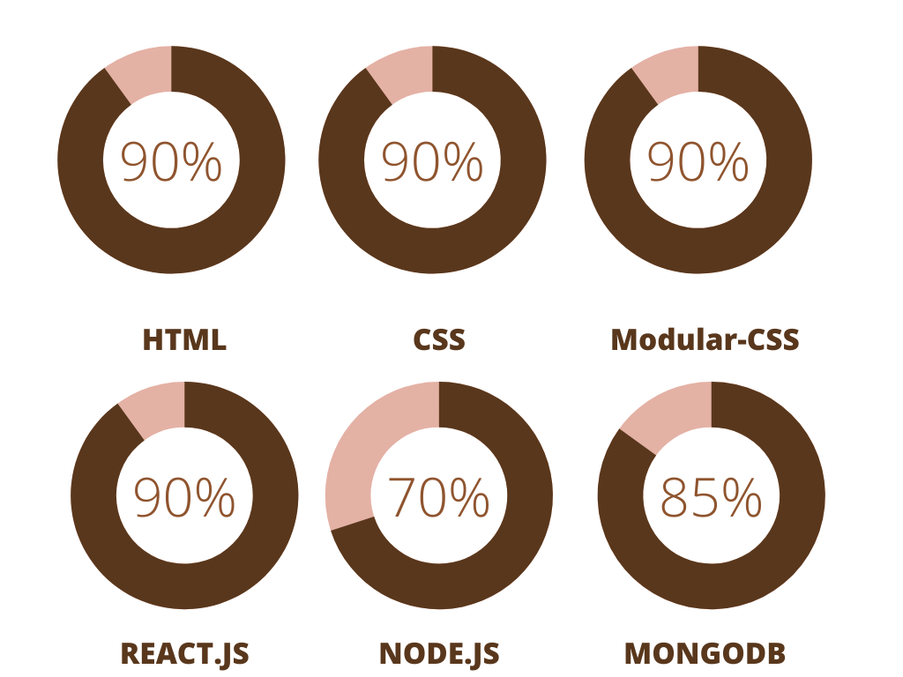

# Product feedback app

## Table of contents

- [Overview](#overview)
  - [Built with](#built-with)
  - [Screenshot](#screenshot)
  - [Links](#links)
  - [Author](#author)
  - [Skills](#skills)

## Overview

### About Project

This project took me about 2 weeks to finish. It's fully backed with a Node.js heroku server and Atlas/MongoDB database. It has a full set of test suites both unit and integretion test's with jest as a test runner .I used a Desktop-first workflow. i used Modular-CSS as a CSS Pattern

### Built with

- Semantic HTML5 markup
- CSS
- Flexbox
- CSS Grid
- Desktop-first workflow
- Vite
- Jest - Test Runner
- [React](https://reactjs.org/) - Frontend framework
- Modular-CSS - For styles
- [Node.js](https://nodejs.org/) - Backend framework
- [Atlas/MongoDB](https://www.mongodb.com/) - NoSQL Database

### Screenshot

### Links

- Project Repo URL: [https://github.com/Abrham007/product-feedback-app.git](https://github.com/Abrham007/product-feedback-app.git)
- Live Site URL: [https://product-feedback-app-6f9b6af9349f.herokuapp.com/](https://product-feedback-app-6f9b6af9349f.herokuapp.com/)

### Author

- Website - [Abrham Araya](https://www.your-site.com)
- Github - [Abrham007](https://github.com/Abrham007)
- Stackover-flow - [Abrham Araya](https://stackoverflow.com/users/22762463/abrham-araya)

### Skills

